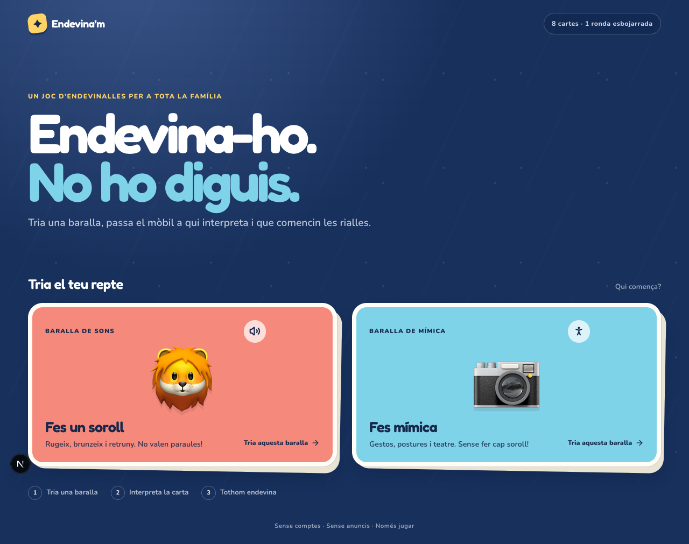

# Endevina’m

A mobile-first family guessing game inspired by physical sound and mime cards. Pick a deck, pass the phone to the performer, and see how many cards the family can guess in one eight-card round.



## What is included

- Sound, mime, and balanced mixed rounds
- A fully Catalan player interface and card deck
- A randomized eight-card round with scorekeeping
- Touch-first controls, keyboard shortcuts, and reduced-motion support
- Installable web-app metadata
- A GitHub Codespaces development container
- Oxlint, Oxfmt, TypeScript, Playwright, and GitHub Actions checks

## Tech stack

- Next.js 16 with the App Router and Turbopack
- React 19 and TypeScript
- Tailwind CSS 4
- shadcn/ui using Base UI primitives
- Oxlint and Oxfmt
- Playwright
- pnpm and Node.js 24

Next.js includes Turbopack, so this project intentionally does not add Vite. Supabase is also deferred: all current cards and round state live locally, and a database only becomes useful once the app needs shared custom decks, accounts, or cross-device progress.

## Develop locally

```bash
pnpm install
pnpm dev
```

Open [http://localhost:3000](http://localhost:3000).

Useful commands:

```bash
pnpm format
pnpm lint
pnpm typecheck
pnpm test:e2e
pnpm build
```

## Keep working while travelling

The repository includes a `.devcontainer` configuration. In GitHub, open **Code → Codespaces → Create codespace on main**. This gives you a complete browser-based editor and development server without cloning anything to your phone or tablet.

For tiny edits, press `.` while viewing the repository to open github.dev. Codespaces is the better option for running the app and tests.

When you are back at a computer, clone it normally:

```bash
gh repo clone marciobarrios/endevinam
cd endevinam
pnpm install
pnpm dev
```

## Project map

```text
app/                 Next.js routes, metadata, and global styles
components/game.tsx  Complete game flow and interaction state
components/ui/       shadcn/Base UI components
lib/cards.ts         Typed sound and mime card decks
tests/               Playwright end-to-end tests
.devcontainer/       GitHub Codespaces setup
.github/workflows/   CI checks
```

## Sensible next iterations

1. Add a round timer.
2. Replace emoji with a cohesive original illustration set.
3. Add optional Spanish and English localizations.
4. Add custom decks, then introduce Supabase for sync only if needed.
5. Deploy to Vercel and add full offline caching.
